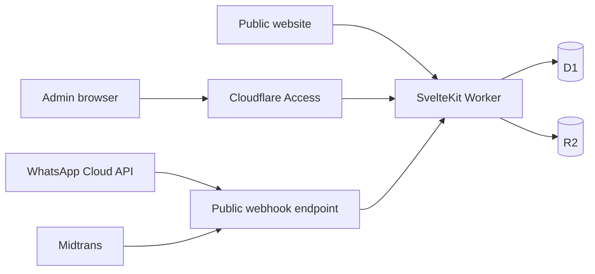

# Security Baseline — V1 Booking, Payment, WhatsApp, and Admin

## Scope and honest status

This document is the **mandatory implementation baseline**. The current repository has no admin routes, booking API, payment integration, database, or authentication code yet; therefore none of those controls are implemented today. Do not describe the product as production-secure until the controls below are coded, configured in the clinic-owned accounts, reviewed, and tested.

No system can be guaranteed immune from attack. The goal is defence in depth: a crawler, stolen browser session, malicious request, duplicate webhook, or compromised credential must not alone provide access to patient data, bookings, payments, or the admin panel.

## Security model

Only public content and narrowly scoped booking entry points are public. The admin hostname is gated by Cloudflare Access **and** application authorization. Webhook endpoints are public by necessity, but accept only valid signed provider events.

## Admin panel: required protection

### 1. Put admin on a separate hostname

Use `admin.doktermetabolik.id`, routed to the same SvelteKit/Cloudflare Worker deployment. The public hostname must not serve the admin UI or admin APIs; accessing `/admin` from `doktermetabolik.id` should return `404`.

This does not require a second repository, Worker, or monthly hosting plan. It gives the admin surface a distinct Cloudflare Access policy, CSP, logs, and lifecycle.

### 2. Cloudflare Access is the first gate

Before the first admin route is deployed:

1. Create a Cloudflare Zero Trust organization owned by the clinic.
2. Create a self-hosted Access application for `admin.doktermetabolik.id/*`.
3. Start with an allow policy containing only named clinic-owner/admin email addresses—never “any email address” or a broad public domain.
4. Prefer Google/Microsoft Workspace identity with the organization’s MFA enabled. One-time email PIN is acceptable for a very small launch team, but is a fallback rather than a replacement for managed MFA.
5. Require reauthentication after a short admin session and remove a user from the policy immediately when their role ends.
6. Make the default policy deny. Cloudflare Access is deny-by-default until a request matches an Allow policy.

Cloudflare Access can protect individual paths or a complete subdomain. It requires a valid authorization token for each request. [Access application paths](https://developers.cloudflare.com/cloudflare-one/access-controls/policies/app-paths/) [Self-hosted Access application](https://developers.cloudflare.com/cloudflare-one/access-controls/applications/http-apps/self-hosted-public-app/)

### 3. The application must still authenticate and authorize

Cloudflare Access alone is not sufficient for an application handling patient and payment data.

- In `hooks.server.ts`, enforce that an admin request arrives on `admin.doktermetabolik.id`.
- Validate the `Cf-Access-Jwt-Assertion` signature, issuer, expiry, and application audience (AUD) using a server-only JWT library such as `jose`. Never trust the presence of the header alone.
- Map the verified email/subject to a local `admin_users` record with a role: `owner` or `staff`.
- Check the role in every admin server action/API route. Hiding buttons in the UI is not authorization.
- `owner` controls users, refunds, payment settings, and destructive actions. `staff` manages slots/content/booking support only. Start with `owner` only until staff access is actually needed.
- Use `HttpOnly`, `Secure`, `SameSite=Lax` session cookies if a local app session is required. Do not store admin tokens in localStorage.
- Require confirmation/re-authentication for refund, deleting content, changing price, changing bank/payment configuration, or adding an admin.

Cloudflare explicitly requires an origin/application to validate the Access JWT signature; accepting its header without validating the token is vulnerable to spoofing. [Validate Access JWTs](https://developers.cloudflare.com/cloudflare-one/access-controls/applications/http-apps/authorization-cookie/validating-json/)

### 4. Prevent admin API exposure

- Put every admin mutation behind the `admin.doktermetabolik.id` hostname and Access policy; do not expose `/api/admin/*` from the public hostname.
- Accept only expected HTTP methods and `Content-Type`; reject everything else.
- Verify same-origin `Origin` on state-changing browser requests and use an anti-CSRF token for cookie-authenticated mutations.
- Enforce server-side schemas, input size limits, pagination limits, and per-role field allowlists.
- Return generic errors to the browser. Log a request ID and safe metadata server-side; never return stack traces, database details, secret values, or raw provider payloads.

## AI crawler and bot controls

### What protects what

| Control | Purpose | Not sufficient for |
| --- | --- | --- |
| Cloudflare Access + validated JWT + role check | Prevents unauthenticated access to admin UI/API | Protecting public booking endpoints from abuse. |
| `robots.txt` | Tells cooperative crawlers not to crawl a path | Security; malicious bots may ignore it. |
| Cloudflare Block AI Bots policy | Blocks known AI training/agent crawlers | Authorization or signed webhook validation. |
| Cloudflare WAF rate limiting + Turnstile | Reduces public endpoint abuse and slot hoarding | Authentication/authorization. |
| Webhook signature verification | Proves event was sent by the payment/WhatsApp provider | Rate limiting or replay prevention by itself. |

### Required Cloudflare settings

1. In **Security Settings → Configure AI bot policies**, block `Training` and `Agent` behavior zone-wide. Keep `Search` allowed only if search indexing is wanted for public articles.
2. Publish `robots.txt` that disallows `/admin/`, `/api/admin/`, and `/api/webhooks/`. This is for good crawler hygiene only; it cannot protect data.
3. Enable one free WAF rate-limit rule for the public booking-start/slot-hold endpoint. Start conservatively at **5 requests per IP per 10 minutes**, then tune from real traffic. Do not apply this rule to payment or WhatsApp webhook paths.
4. Use Cloudflare Turnstile on public web booking/form endpoints. WhatsApp conversations do not need a web CAPTCHA.
5. Add a custom WAF rule to block all requests to `/api/admin/*` arriving on the public hostname; the same route must be reached only via `admin.doktermetabolik.id` and Cloudflare Access.

Cloudflare currently allows all customers to block AI bots/agents by behavior. Its free Bot Fight Mode applies to an entire domain and cannot be skipped for webhook paths; do **not** enable Bot Fight Mode blindly because it can challenge legitimate API/webhook traffic. Use the AI bot policy, path/host WAF rules, and application controls above instead. [Block AI bots](https://developers.cloudflare.com/bots/additional-configurations/block-ai-bots/) [Bot Fight Mode limitations](https://developers.cloudflare.com/bots/get-started/bot-fight-mode/) [WAF rate limiting](https://developers.cloudflare.com/waf/rate-limiting-rules/)

## Public booking and payment controls

- Create a slot hold atomically in one database transaction; it must fail when a valid hold/booking already exists for that slot.
- Never accept a price, booking status, payment status, refund amount, role, or patient ID directly from the browser as authoritative. Derive them server-side.
- Use a hosted Midtrans checkout. The application must never receive or store card details.
- Use a unique payment order ID, exact expected amount/currency, expiry time, and idempotency record.
- Verify the Midtrans signature and expected transaction fields before setting a booking to `confirmed`.
- Save a webhook event ID or provider transaction ID with a unique constraint. A duplicate webhook must be a safe no-op.
- Treat payment URL screenshots, chat messages, and browser redirects as informational only—not payment proof.
- Do not log patient form bodies, card/payment data, authorization headers, cookies, API secrets, WhatsApp message bodies, or raw webhook payloads.

## WhatsApp webhook controls

- Keep the Meta verify token and access token in Cloudflare Worker secrets, never in Git, browser code, or documentation.
- Validate the Meta webhook signature before processing the request body.
- Deduplicate webhook events and make every state transition idempotent.
- Respond quickly after secure receipt, then process only the necessary work; failed/retried messages must not send duplicate booking/payment messages.
- Use approved templates and auditable opt-in for outbound reminders. Never include detailed health information in notification templates.
- Give the human handoff operator the minimum data necessary: booking code and category, not a complete patient record.

## CMS, media, and dashboard controls

- Store article body as Markdown and render through an allow-list sanitizer. Never render user/admin-provided HTML directly.
- Validate media type and size server-side; generate non-guessable object keys; require admin authorization for uploads and deletes.
- Do not expose R2 write credentials to the browser. Upload through a server-authorized flow; add signed upload URLs only when large-file volume makes it necessary.
- Audit every publish/unpublish, slot change, booking change, refund request, admin invitation/removal, and payment setting change with actor, timestamp, target ID, and request ID. Do not include sensitive values in audit logs.

## Secrets, deployment, and ownership

- Clinic owns the Cloudflare, Meta, Midtrans, Hostinger, and GitHub accounts. Developers are invited with least-privilege roles and removed after handover.
- Enable MFA on every vendor account. Store recovery codes offline with the business owner.
- Use different development/staging/production credentials and D1 databases. Production secrets are entered through Cloudflare secrets, never `.env` committed to Git.
- Restrict CI deployment credentials to the minimum Cloudflare zone/Worker/D1 permissions. Rotate credentials after a developer leaves or a suspected incident.
- Pin and regularly update dependencies; run `npm run validate` and `npm audit` in CI. Review security advisories before deploying.

## Required security tests before launch

1. Anonymous request to admin hostname is blocked by Access.
2. A request with a forged `Cf-Access-Jwt-Assertion` is rejected by the application.
3. A valid `staff` user cannot complete an `owner` action.
4. Public hostname cannot reach any admin page or admin API.
5. Cross-site POST to an admin mutation fails CSRF/origin checks.
6. Invalid, replayed, and duplicated Meta/Midtrans webhook events do not alter booking/payment state.
7. Two concurrent slot requests cannot create two valid holds/bookings.
8. A payment amount/order ID mismatch cannot confirm booking.
9. CMS HTML/script payload cannot execute when published.
10. Public booking rate limit and Turnstile failure block the action without exposing internal errors.
11. Application logs and browser responses contain no secrets or patient detail beyond what the current user is authorized to see.
12. A test admin user can be revoked in Cloudflare Access and immediately loses access.

## Launch gate

Do not turn on public booking/payment until all twelve tests pass, the clinic owner has reviewed the privacy/refund flow, and the owners can access the incident contact/runbook. This is a V1 baseline; a formal security assessment and legal/compliance review are appropriate before storing more detailed health records or scaling staff access.
