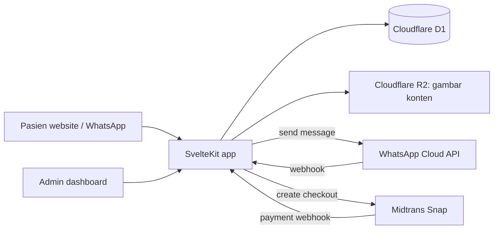

# Arsitektur V1 dan Infrastruktur Hemat Biaya

## Keputusan rekomendasi

Gunakan **satu repository dan satu aplikasi SvelteKit** untuk website, sistem booking, dashboard admin, CMS ringan, payment webhook, dan chatbot WhatsApp. Repository ini sudah memakai Svelte 5, SvelteKit, TypeScript, Tailwind, shadcn-svelte, dan `svelte-i18n`; semuanya tetap dipakai.

Jangan membuat repository chatbot atau backend terpisah pada V1. Satu aplikasi menghilangkan duplikasi jadwal, status booking, login, pembayaran, deployment, dan monitoring. Tambahkan service terpisah hanya jika volume, integrasi, atau kebutuhan tim benar-benar menuntutnya.

## Bahasa dan teknologi

| Kebutuhan | Pilihan V1 | Alasan |
| --- | --- | --- |
| Bahasa aplikasi | **TypeScript** | Satu bahasa untuk UI Svelte dan route server/webhook; sudah menjadi bahasa repository ini. |
| Frontend dan server | **SvelteKit + Svelte 5** | Website, dashboard, endpoint server, dan webhook berada dalam satu aplikasi. |
| UI | Tailwind + shadcn-svelte + Lucide | Sudah sesuai konvensi repository; jangan tambah design system lain. |
| Database | **Cloudflare D1 (SQLite) + Drizzle ORM** | SQL terkelola, serverless, murah; Drizzle memberi schema TypeScript dan migration yang dapat ditinjau. |
| Deploy dan API runtime | **Cloudflare Workers** dengan `@sveltejs/adapter-cloudflare` | Menjalankan SvelteKit dan menerima webhook tanpa VPS yang selalu menyala. |
| File/gambar konten | **Cloudflare R2** | Penyimpanan gambar konten murah, termasuk 10 GB dan tanpa biaya egress pada tier gratis saat ini. |
| Pembayaran | **Midtrans Snap**, aktifkan QRIS + virtual account dahulu | Checkout siap pakai dan webhook status pembayaran; tambahkan metode lain setelah ada kebutuhan. |
| WhatsApp | **WhatsApp Cloud API langsung dari Meta** | Hindari biaya markup BSP pada V1; endpoint webhook tetap berada di aplikasi yang sama. |
| Client server-state | `@tanstack/svelte-query` bila UI browser membutuhkan fetch/mutasi | Wajib digunakan oleh konvensi repository untuk state API di klien. |
| Bahasa data | SQL untuk migration/query; JSON untuk payload API | Tidak perlu GraphQL atau ORM besar/berbasis engine. |

Saya memilih TypeScript, bukan Python, PHP, Java, atau Go, bukan karena bahasa itu kurang baik, tetapi karena TypeScript telah dipakai aplikasi ini dan dapat menangani UI serta server. Menambah bahasa kedua sekarang hanya menambah deployment, rekrutmen, dan maintenance.

### ORM: gunakan Drizzle, bukan tanpa ORM

Rekomendasi awal “tanpa ORM” terlalu hemat untuk domain booking dan pembayaran. ORM ringan layak dipakai karena tabel, status, constraint, dan migration akan berkembang serta harus konsisten antara development, staging, dan production.

Gunakan **Drizzle ORM** dan **Drizzle Kit** saat feature database pertama mulai dibangun:

- Definisikan schema SQLite dan relasi secara typed di TypeScript.
- Generate migration SQL yang masuk Git dan selalu direview dalam pull request.
- Terapkan migration ter-review ke D1; jangan gunakan schema push otomatis pada production.
- Gunakan Drizzle untuk query/repository biasa.
- Untuk operasi atomik yang sangat penting—mengambil hold slot dan mengonfirmasi payment—repository boleh memakai parameterized `D1.batch()` di satu transaksi. ORM tidak menggantikan constraint database atau verifikasi webhook.

Drizzle mendukung Cloudflare D1/Workers secara langsung, dan Drizzle Kit dapat menghasilkan serta mengelola migration SQL. [Drizzle untuk Cloudflare D1](https://orm.drizzle.team/docs/sqlite/connect-cloudflare-d1) [Dokumentasi migration Drizzle](https://orm.drizzle.team/docs/migrations)

## Bentuk aplikasi: satu repo, satu deployment

```text
doctor-booking/
  src/
    routes/
      (site)/                 # homepage, artikel, profil dokter
      booking/                # booking web (fase 2 bila diperlukan)
      admin/                  # dashboard, jadwal, booking, artikel, media
      api/webhooks/whatsapp/  # verifikasi + event WhatsApp Cloud API
      api/webhooks/midtrans/  # notifikasi payment, signature verification
    features/
      booking/                # slot, hold, registrasi, booking
      payments/               # create Snap transaction, status, refund request
      whatsapp/               # payload, flow, template, handoff admin
      content/                # article/page/media admin CMS
      admin/                  # authorization dan dashboard compositions
    lib/
      server/
        db/                   # Drizzle client dan D1 binding, tanpa business logic
        vendors/              # client Midtrans/Meta/R2 yang tipis
        auth/                 # session dan password primitives
  drizzle/                    # SQL migrations generated dan direview
  drizzle.config.ts           # konfigurasi Drizzle Kit
  wrangler.jsonc              # bindings D1/R2 dan environment deployment
```

Fitur boleh berbagi hanya melalui API/domain functions yang disepakati. `booking` adalah pemilik slot dan status booking; `whatsapp` bukan pemilik salinan jadwal. Dengan begitu booking dari website dan WhatsApp selalu memeriksa database yang sama.

### Batas backend per feature

Route SvelteKit hanya menerjemahkan HTTP/WhatsApp webhook menjadi input service dan menghasilkan response. Route tidak boleh berisi query database, keputusan booking, atau akses vendor langsung.

```text
src/features/booking/
  index.ts                    # satu-satunya public export feature
  types/                      # types dan status domain
  schemas/                    # validasi input/request boundary
  server/
    schema.ts                 # tabel Drizzle milik booking
    repository.ts             # query D1/Drizzle hanya untuk tabel booking
    service.ts                # hold, confirm, expire, cancel; business rules

src/features/payments/
  index.ts
  types/
  schemas/
  server/
    schema.ts
    repository.ts
    service.ts                # create order, verify webhook, refund request

src/features/whatsapp/
  index.ts
  schemas/
  server/
    service.ts                # state flow, render message, handoff
```

Aturan dependency:

```text
route/webhook -> feature service -> feature repository -> lib/server/db or vendor
route/component -> feature public index.ts
feature A -> feature B/index.ts only, never feature B/server/internal file
```

Gunakan Zod pada batas data tidak tepercaya—form pasien, payload Meta, payload Midtrans, dan query parameter. UI tidak pernah mengimpor file `server/`; hanya server route/service yang dapat mengakses D1, R2, secret, atau vendor client.

## Jalur migrasi ke monorepo

Struktur di atas **belum monorepo**; itu adalah modular monolith. Ini sengaja agar V1 memiliki satu package manager, satu deploy, dan satu database transaction. Namun batas feature dan `index.ts` membuat pemindahan kelak mekanis, bukan rewrite.

Jangan membuat `apps/`, `packages/`, atau workspace config sekarang. Buat monorepo hanya jika setidaknya satu kondisi ini terjadi:

1. WhatsApp membutuhkan deployment/scale/release cadence yang berbeda dari website.
2. Aplikasi mobile, portal klinik lain, atau layanan kedua perlu memakai domain booking yang sama.
3. Dua tim berbeda perlu memiliki aplikasi/deployment berbeda.
4. Build/deploy V1 benar-benar menjadi bottleneck yang terukur.

Saat kondisi tersebut muncul, pindahkan tanpa mengubah aturan domain menjadi:

```text
doctor-booking/
  apps/
    clinic-web/               # SvelteKit public site + admin dashboard
    whatsapp-worker/          # hanya bila webhook/bot perlu deploy terpisah
  packages/
    booking-domain/           # types, state transition, validation, no D1 binding
    payment-domain/           # payment status/rules, no vendor secret
    database/                 # Drizzle schema, migrations, repository adapters
    contracts/                # request/event types shared antar app bila perlu
    ui/                       # hanya bila web/admin kedua benar-benar muncul
```

Urutan migrasi yang aman:

1. Pindahkan pure types, schemas, dan state-transition function dari satu feature ke `packages/booking-domain`.
2. Pindahkan Drizzle schema/migrations dan repository adapter ke `packages/database` tanpa mengubah database D1.
3. Pindahkan route WhatsApp menjadi `apps/whatsapp-worker` hanya jika independent deploy memang dibutuhkan; gunakan endpoint/domain service yang sama, bukan salinan tabel.
4. Tambahkan workspace tooling dan CI cache setelah ada minimal dua package/app yang nyata.

Jangan membuat repository terpisah pada proses ini. Monorepo tetap satu repository dan memungkinkan atomic change terhadap app, shared package, dan schema migration dalam satu pull request.

## Alur V1 yang paling kecil tetapi lengkap



### Booking

1. Admin membuat slot manual di dashboard: tanggal, jam mulai, jam selesai, jenis konsultasi, harga, dan status.
2. Pasien memilih slot dari WhatsApp. Server membuat hold selama 60 menit memakai constraint database, bukan state chat di browser.
3. Bot mengumpulkan data minimum, membuat order Midtrans, lalu mengirim tombol checkout.
4. Midtrans webhook yang telah diverifikasi—bukan pesan “sudah bayar” dari pasien—mengubah booking menjadi `confirmed`.
5. Dashboard menampilkan booking, pembayaran, hold yang kedaluwarsa, dan status pengingat.

Gunakan slot manual pada V1. Jangan membangun aturan kalender berulang, sinkronisasi Google Calendar, multi-cabang, dan reschedule otomatis sampai pola operasional klinik sudah stabil.

### CMS ringan di dashboard

CMS V1 cukup memiliki CRUD berikut di `/admin`:

- Artikel: judul, slug, kategori, ringkasan, isi Markdown, status draft/published, tanggal publikasi, gambar utama.
- Halaman statis: Tentang Kami, profil Dokter Oscar, kebijakan privasi, syarat, refund policy.
- Media: unggah gambar ke R2 lalu simpan URL dan alt text.
- Jadwal/slot: CRUD slot konsultasi.
- Booking: daftar, filter status, detail minimum, dan handoff admin.

Gunakan textarea Markdown dengan renderer dan sanitasi allow-list, bukan editor WYSIWYG kustom pada V1. Ini memenuhi pengelolaan artikel tanpa editor kompleks, lisensi editor, atau risiko HTML bebas. Tambahkan rich-text editor hanya setelah admin membuktikan Markdown menjadi hambatan.

### Auth dan peran

- **Admin:** email + password dengan password hash kuat, session cookie `HttpOnly`, `Secure`, `SameSite=Lax`, dan tabel `users`/`sessions`. Mulai dengan role `admin` tunggal; tambah `staff` hanya saat ada staf yang benar-benar perlu akses.
- **Pasien WhatsApp:** nomor pengirim WhatsApp menjadi identitas sesi bot. Untuk alur lewat WhatsApp, jangan menambah SMS OTP hanya untuk menduplikasi verifikasi channel—ini memangkas biaya dan satu titik gagal.
- **Booking web:** V1 paling murah adalah tombol “Booking via WhatsApp” dari website. Bila booking web mandiri diperlukan, kirim kode sekali pakai ke WhatsApp dan konfirmasi nomor sebelum menampilkan atau mengubah booking.

Ini berarti rekomendasi V1 adalah WhatsApp sebagai pintu booking utama, sementara website berfungsi untuk konten dan mengarahkan ke WhatsApp. Website booking penuh dapat ditambahkan tanpa memindahkan database atau chatbot.

## Skema data minimum

| Tabel | Isi minimum | Catatan |
| --- | --- | --- |
| `users`, `sessions` | akun dashboard dan session admin | Tidak digunakan sebagai akun pasien V1. |
| `consultation_types` | nama, durasi, harga, aktif | Mulai satu jenis konsultasi. |
| `slots` | mulai, selesai, status, consultation type | Admin mengelola slot manual. |
| `slot_holds` | slot, nomor WhatsApp, expires_at, status | Unik per slot aktif; kedaluwarsa 60 menit. |
| `patients` | nama, nomor WhatsApp, tanggal lahir bila diperlukan | Simpan data minimum, tidak ada rekam medis detail. |
| `bookings` | patient, slot, nominal, status, booking code | Status: pending/confirmed/cancelled/expired. |
| `payment_orders` | order ID, booking, provider ID, status, expiry | Pencatatan idempoten untuk webhook. |
| `webhook_events` | provider, event ID, received_at, payload hash | Mencegah notifikasi ganda diproses dua kali. |
| `content_items` | type, title, slug, markdown, status, published_at | Artikel dan halaman statis. |
| `media` | object key, alt, width, height | File ada di R2, bukan di database. |

Gunakan `STRICT` tables, foreign keys, unique indexes, prepared statements, serta transaksi `D1.batch()` untuk hold slot dan konfirmasi payment. Dokumentasi D1 menyatakan `batch()` dijalankan sebagai transaksi dan akan rollback bila ada statement yang gagal. [Dokumentasi D1 batch](https://developers.cloudflare.com/d1/worker-api/d1-database/)

## Infrastruktur minimum dan biaya

### Domain Hostinger dan Cloudflare

Domain `doktermetabolik.id` dapat tetap terdaftar dan diperpanjang di Hostinger, lalu digunakan oleh aplikasi Cloudflare. Dukungan `.id` yang tidak tersedia di **Cloudflare Registrar** bukan hambatan: domain tidak perlu ditransfer ke Cloudflare. Cloudflare hanya menjadi pengelola DNS dan hosting aplikasi.

Alur yang aman:

1. Pemilik klinik membuat akun Cloudflare atas email bisnis klinik dan mengundang developer ke akun tersebut.
2. Developer menambahkan `doktermetabolik.id` sebagai domain eksternal di Cloudflare, memeriksa DNS records yang terdeteksi, lalu mengirim dua nameserver Cloudflare yang ditetapkan kepada pemilik klinik.
3. Pemilik klinik mengganti nameserver di Hostinger dengan tepat dua nameserver tersebut. Jangan menebak atau memasukkan nameserver sebelum domain dibuat di Cloudflare.
4. Developer menyalin/menambahkan record yang diperlukan di Cloudflare: `www`, MX, SPF, DKIM, DMARC, dan record layanan lain yang sedang digunakan.
5. Setelah status domain Cloudflare menjadi `Active`, developer menghubungkan `doktermetabolik.id` dan `www.doktermetabolik.id` ke deployment aplikasi, lalu menguji HTTPS dan email.

Perubahan nameserver dapat memerlukan waktu hingga 24 jam. Jika record email tidak disalin sebelum perubahan, email bisnis dapat berhenti bekerja. Cloudflare menjelaskan bahwa full setup memakai nameserver yang mereka tetapkan dan seluruh DNS kemudian dikelola dari Cloudflare. [Panduan setup domain eksternal Cloudflare](https://developers.cloudflare.com/dns/zone-setups/full-setup/setup/)

### Yang perlu dikirim pemilik klinik kepada developer

Kirim daftar ini kepada pemilik klinik. Jangan meminta password, OTP, API secret, atau kredensial payment gateway melalui WhatsApp/email.

> Untuk menyiapkan website, booking, WhatsApp, dan pembayaran Dokter Metabolik, mohon kirim/siapkan:
>
> 1. Nama domain final: `doktermetabolik.id`, serta konfirmasi apakah domain sedang dipakai untuk website atau email.
> 2. Screenshot atau export DNS Hostinger saat ini, terutama bila ada email bisnis. Mohon sertakan record MX, SPF, DKIM, dan DMARC bila ada.
> 3. Email bisnis yang akan menjadi pemilik akun Cloudflare. Silakan buat akun Cloudflare memakai email tersebut, kemudian undang developer; jangan kirim password akun.
> 4. Konfirmasi siapa yang berwenang mengubah nameserver di Hostinger. Developer akan mengirim dua nameserver Cloudflare yang harus dipasang oleh pemilik akun.
> 5. Nama bisnis resmi, alamat, email/nomor dukungan, logo, dan detail yang akan ditampilkan pada website serta profil WhatsApp Business.
> 6. Konten yang sudah siap: profil dan kredensial Dokter Oscar, jenis konsultasi, durasi, harga, jadwal awal, aturan pembatalan/reschedule/refund, serta Kebijakan Privasi dan Syarat Layanan bila tersedia.
> 7. Untuk WhatsApp: email pemilik Meta Business Portfolio, nomor WhatsApp bisnis khusus yang akan dipakai, dan orang yang berwenang menyetujui template pesan. Nomor tersebut sebaiknya tidak sedang dipakai aplikasi WhatsApp biasa.
> 8. Untuk pembayaran: email pemilik akun Midtrans, rekening settlement, data/dokumen merchant yang dibutuhkan gateway, serta orang yang berwenang menyetujui onboarding. Berikan akses melalui fitur user/team gateway, bukan dengan membagikan password atau Server Key.
> 9. Nama dan kontak admin manusia, jam layanan, serta aturan handoff untuk masalah booking, pembayaran, pembatalan, dan keadaan darurat.
> 10. Satu product owner yang berwenang menyetujui konten, flow, dan hasil uji sebelum go-live.

Developer perlu mengirim balik kepada pemilik klinik:

- Dua nameserver Cloudflare yang benar untuk dipasang di Hostinger.
- Daftar DNS record yang akan dipindahkan dan konfirmasi setelah record email teruji.
- Undangan akses yang paling kecil diperlukan ke Cloudflare/Meta/Midtrans, bukan permintaan kredensial.
- URL staging untuk persetujuan sebelum domain production diarahkan.
- Checklist go-live dan kontak ketika perubahan DNS berlangsung.

### Yang dibuat sekali

1. Akun Cloudflare milik klinik, bukan akun personal developer.
2. DNS domain `doktermetabolik.id` diarahkan ke Cloudflare. Domain sudah dimiliki, jadi tidak perlu membeli domain baru.
3. Satu Cloudflare Worker, satu D1 database production, satu R2 bucket `media`, dan satu environment preview/development lokal.
4. Meta Business Portfolio, WhatsApp Business Account, nomor bisnis khusus, dan WhatsApp Cloud API.
5. Akun Midtrans milik klinik serta kredensial sandbox/production.
6. Satu rekening settlement dan kontak operasional untuk refund/pembatalan.

### Biaya teknis V1

| Komponen | Rekomendasi | Biaya awal | Biaya tetap bulanan | Catatan |
| --- | --- | ---: | ---: | --- |
| Web, API, webhook, database | Cloudflare Workers Paid + D1 | US$0 | **minimum US$5/bulan** | Pilih paid untuk production agar free-tier harian tidak dapat menghentikan booking. |
| File gambar konten | Cloudflare R2 | US$0 | Umumnya US$0 pada V1 | Free tier saat ini: 10 GB, 1 juta Class A, 10 juta Class B request/bulan; aktifkan billing account untuk R2. |
| Domain | Domain yang sudah ada | US$0 | Renewal Hostinger | Di luar biaya Cloudflare; cek tanggal renewal di akun pemilik domain. |
| Payment gateway | Midtrans | US$0 | US$0 fixed yang diasumsikan | Biaya pembayaran per transaksi, bukan biaya server. |
| WhatsApp Cloud API | Meta | US$0 setup yang diasumsikan | Tergantung penggunaan | Template/percakapan proaktif ditagihkan sesuai rate card dan kategori pesan Meta saat akun dibuat. |
| Email/SMS | Tidak dipakai pada MVP | US$0 | US$0 | Tambahkan hanya jika booking web mandiri/OTP fallback benar-benar diperlukan. |
| Monitoring | Cloudflare dashboard + log | US$0 | US$0 | Tambahkan layanan error monitoring jika traffic atau tim meningkat. |

Target biaya platform tetap V1 adalah **sekitar US$5/bulan plus perpanjangan domain**. Jangan gunakan Workers Free untuk production booking: batas gratis saat ini adalah 100.000 request/hari dan D1 memiliki batas harian; setelah terlewati, query dapat gagal sampai reset. Workers Paid memiliki minimum US$5/bulan. [Harga Workers](https://developers.cloudflare.com/workers/platform/pricing/) [Harga D1](https://developers.cloudflare.com/d1/platform/pricing/)

Tambahkan biaya variabel berikut ke proyeksi bisnis, bukan ke biaya hosting:

- **QRIS:** Midtrans mendokumentasikan MDR 0,7% pada transaksi sukses untuk merchant reguler. [Biaya QRIS Midtrans](https://docs.midtrans.com/docs/berapa-biaya-transaksi-untuk-qris)
- **WhatsApp:** hanya kirim template yang disetujui untuk pesan bisnis proaktif, siapkan opt-in, dan gunakan biaya sesuai rate card Meta/BSP akun tersebut. [Kebijakan WhatsApp Business](https://business.whatsapp.com/policy/preview?lang=id_ID)
- **Refund, e-wallet, kartu, atau virtual account:** aktifkan kemudian dan gunakan biaya yang dikonfirmasi Midtrans pada onboarding.

Cloudflare D1 saat ini memberi Workers Free 5 juta row read/hari, 100.000 row write/hari, dan 5 GB total storage; R2 memberi 10 GB storage serta 1 juta/10 juta operasi bulanan dalam free tier. Ini menunjukkan V1 sangat murah, tetapi quota harian bukan alasan yang tepat untuk mempertaruhkan penerimaan pembayaran pasien. [Harga D1](https://developers.cloudflare.com/d1/platform/pricing/) [Harga R2](https://developers.cloudflare.com/r2/pricing/)

## Keamanan yang tidak boleh dipangkas

Lihat [security-baseline.md](./security-baseline.md) untuk kontrol wajib sebelum admin, booking, payment, atau webhook dianggap siap production.

- Simpan secret Cloudflare, Meta, dan Midtrans sebagai environment secret; jangan di Git atau browser.
- Verifikasi signature setiap webhook WhatsApp dan Midtrans sebelum membaca/mengubah data.
- Gunakan idempotency: event payment yang sama tidak boleh membuat booking atau pesan konfirmasi kedua kali.
- Rate-limit endpoint public dan validasi semua input server-side.
- Gunakan database migration, backup/export terjadwal, dan uji pemulihan sebelum production.
- Simpan data pasien minimum; jangan pakai chat sebagai rekam medis atau meminta data klinis rinci di WhatsApp.
- Tampilkan privacy notice dan consent sebelum form, serta batasi akses dashboard berdasarkan role.

Sebelum go-live, pemilik klinik perlu meninjau kewajiban privasi dan penanganan data kesehatan dengan penasihat hukum/kepatuhan yang tepat. Infrastruktur murah tidak menggantikan kewajiban tersebut.

## Urutan pembangunan yang disarankan

1. Setup Cloudflare, Meta, Midtrans, environment secrets, dan database schema.
2. Dashboard admin: login, slot manual, jenis konsultasi, daftar booking.
3. Domain booking: hold 60 menit, patient minimum, payment order, webhook Midtrans.
4. Integrasi WhatsApp: menu, daftar slot, registrasi, checkout, konfirmasi, dan handoff.
5. CMS: artikel, halaman statis, upload media R2.
6. Uji webhook palsu/duplikat, tabrakan slot, expiry, payment gagal, dan role dashboard.
7. Soft launch dengan nomor internal; baru aktifkan reminder dan promosi setelah alur stabil.

## Tunda sampai ada bukti kebutuhan

- Microservices, repository chatbot kedua, message queue, Redis, Kubernetes, dan VPS.
- CRM/headless CMS eksternal seperti Strapi/Directus, editor WYSIWYG premium, atau search engine khusus.
- Google Calendar sync dua arah, kalender berulang kompleks, multi-dokter/multi-cabang, voucher, dan reschedule otomatis.
- AI untuk menjawab pertanyaan medis, video consultation, EMR, e-resep, asuransi, dan aplikasi mobile.

Tambahkan salah satu hanya ketika jumlah booking, staf, regulasi, atau data operasional membuktikan bahwa V1 tidak lagi cukup.
