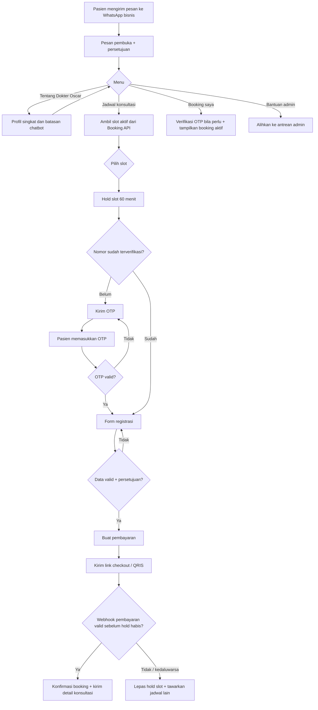

# Alur WhatsApp Chatbot — Dokter Metabolik

Dokumen ini adalah rancangan produk dan teknis untuk chatbot WhatsApp Dokter Metabolik. Chatbot dapat dibangun sebagai layanan terpisah dari website; keduanya memakai satu backend booking agar ketersediaan jadwal, data pasien, dan status pembayaran selalu sama.

## Tujuan MVP

1. Memperkenalkan konsultasi dengan Dokter Oscar Sugi secara singkat.
2. Menampilkan jadwal konsultasi yang masih tersedia.
3. Mengumpulkan data pendaftaran pasien yang diperlukan untuk booking.
4. Menerima pembayaran digital dan mengonfirmasi booking hanya setelah webhook pembayaran valid.
5. Mengalihkan pertanyaan medis, keluhan darurat, perubahan jadwal, atau masalah pembayaran kepada admin manusia.

Chatbot bukan sarana diagnosis atau keadaan darurat. Pesan pembuka perlu memuat pemberitahuan singkat: untuk keadaan darurat, pasien harus menghubungi layanan darurat/fasilitas kesehatan terdekat, bukan menunggu balasan chat.

## Prinsip alur

- Bahasa utama: Indonesia. Sediakan pilihan English bila diperlukan.
- Gunakan tombol/list WhatsApp untuk pilihan yang terbatas; jangan meminta pasien mengingat format teks.
- Nomor WhatsApp adalah identitas awal. Jangan menganggap nomor itu sudah terverifikasi sebagai pemilik pasien tanpa OTP.
- Buat *hold* slot selama 60 menit setelah slot dipilih. Satu slot hanya boleh memiliki satu hold aktif.
- Pembayaran dan pembukaan slot dikendalikan server. Pesan pengguna seperti “sudah bayar” tidak mengubah status booking.
- Jangan mengirim anamnesis, diagnosis, atau data medis sensitif ke grup WhatsApp/admin yang tidak berwenang.

## Peta alur utama



## Percakapan yang disarankan

### 1. Pesan pembuka

> Halo, selamat datang di Dokter Metabolik. Saya asisten virtual untuk konsultasi Dokter Oscar Sugi. Saya dapat membantu melihat jadwal, mendaftar, dan membayar booking. Chat ini bukan layanan darurat atau pengganti konsultasi medis.

Tombol: `Lihat jadwal`, `Tentang Dokter Oscar`, `Booking saya`, `Bantuan admin`.

Sebelum data registrasi pertama dikumpulkan, minta persetujuan: data digunakan untuk proses booking dan konsultasi sesuai Kebijakan Privasi. Tombol: `Saya setuju`, `Baca kebijakan`.

### 2. Tentang Dokter Oscar

Kirim profil yang telah disetujui pemilik klinik: nama, kredensial, fokus layanan, durasi konsultasi, biaya, serta tautan website. Hindari klaim hasil pengobatan atau jawaban medis personal. Akhiri dengan `Lihat jadwal` dan `Kembali ke menu`.

### 3. Jadwal aktif dan pemilihan slot

1. Backend membaca slot berstatus `available` dari sumber booking yang sama dengan website.
2. Bot menampilkan maksimal 5–10 slot per halaman, menggunakan zona waktu WIB dan format yang jelas, misalnya “Selasa, 30 Sep, 10.00–10.30 WIB”.
3. Saat pasien memilih satu slot, backend membuat `slot_hold` atomik selama 60 menit. Jika slot baru saja diambil pasien lain, tampilkan jadwal terbaru dan minta memilih lagi.
4. Bot menyebutkan batas waktu hold dan melanjutkan ke verifikasi/registrasi.

### 4. Verifikasi dan form registrasi

Verifikasi nomor dengan OTP WhatsApp/SMS sebelum atau saat data pasien disimpan. Batasi percobaan OTP, masa berlaku, dan pengiriman ulang untuk mencegah penyalahgunaan.

Urutan form MVP:

1. Nama lengkap pasien.
2. Tanggal lahir.
3. Jenis kelamin — hanya bila benar-benar diperlukan oleh proses klinis.
4. Nomor WhatsApp (ditampilkan untuk konfirmasi; sumbernya nomor chat).
5. Email (opsional, untuk salinan konfirmasi).
6. Kota/domisili (opsional bila hanya konsultasi online; wajib bila ada kebutuhan layanan tertentu).
7. Nama kontak darurat dan nomor kontak (opsional, jika kebijakan klinik membutuhkannya).
8. Persetujuan pemrosesan data dan syarat pembatalan/refund.

Jangan mengumpulkan NIK/KTP, foto identitas, rekam medis panjang, atau keluhan rinci di chatbot MVP kecuali ada kebutuhan operasional dan dasar pemrosesan data yang sudah ditetapkan. Bila pra-konsultasi diperlukan, gunakan formulir aman yang tertaut dari chat.

Setelah semua jawaban diterima, bot menampilkan ringkasan: pasien, jadwal, durasi, biaya, dan kebijakan pembatalan. Pasien memilih `Lanjut pembayaran` atau `Ubah data`.

### 5. Pembayaran

1. Server membuat order unik yang terkait dengan `slot_hold`, pasien, nominal, dan waktu kedaluwarsa.
2. Buat transaksi lewat payment gateway dan kirim tombol `Bayar sekarang` ke halaman checkout. Untuk QRIS, checkout harus menampilkan QR dinamis dan/atau deep link yang didukung gateway.
3. Tetapkan kedaluwarsa pembayaran agar tidak melampaui hold slot 60 menit. Jika gateway memiliki masa berlaku lebih pendek, izinkan pembuatan ulang link hanya selama hold masih aktif.
4. Gateway memanggil webhook server setelah status berubah. Server harus memverifikasi signature, nominal, order ID, dan status settlement/sukses sebelum menandai booking `confirmed`.
5. Setelah valid, ubah hold menjadi booking terkonfirmasi dalam satu transaksi database, lalu kirim nomor booking, jadwal, link konsultasi/lokasi, dan instruksi persiapan.
6. Jika pembayaran pending atau kedaluwarsa, kirim pengingat; saat hold berakhir, tandai order `expired`, lepaskan slot, dan tawarkan jadwal lain.

Untuk Indonesia, Midtrans adalah satu opsi gateway yang mendukung QRIS; dokumentasinya menunjukkan bahwa integrasi membuat transaksi, menampilkan QR, lalu menangani notifikasi pembayaran. Pilihan gateway tetap perlu diputuskan berdasarkan onboarding merchant, biaya, metode yang diinginkan, dan kebijakan refund. [Dokumentasi QRIS Midtrans](https://docs.midtrans.com/reference/qris)

### 6. Booking saya, pembatalan, dan admin

Menu `Booking saya` meminta OTP bila sesi belum terverifikasi, lalu menampilkan booking aktif dan status: `menunggu pembayaran`, `terkonfirmasi`, `dibatalkan`, atau `kedaluwarsa`.

- `Bayar lagi`: buat link baru hanya jika slot masih di-hold dan belum kedaluwarsa.
- `Jadwalkan ulang` atau `Batalkan`: jalankan sesuai kebijakan klinik; jika melibatkan refund, buat tiket admin terlebih dahulu pada MVP.
- `Bantuan admin`: buat handoff dengan ringkasan aman (nomor booking dan kategori masalah), bukan seluruh data pasien.
- Bila kata kunci darurat terdeteksi, berikan arahan darurat standar dan handoff prioritas; bot tidak boleh memberi saran klinis individual.

## Status dan aturan backend

| Entitas | Status inti | Aturan |
| --- | --- | --- |
| Slot | `available`, `held`, `booked`, `blocked` | Tidak boleh dua hold aktif untuk slot yang sama. |
| Slot hold | `active`, `expired`, `converted`, `released` | Berlaku 60 menit; terikat pada pasien dan order. |
| Registration | `draft`, `verified`, `complete` | Lengkap hanya setelah OTP dan persetujuan berhasil. |
| Payment | `created`, `pending`, `paid`, `failed`, `expired`, `refunded` | `paid` hanya dari webhook gateway terverifikasi. |
| Booking | `payment_pending`, `confirmed`, `cancelled`, `expired` | Hanya `confirmed` yang mengunci slot sebagai booking final. |

Webhook wajib idempoten: event yang terkirim dua kali tidak boleh membuat dua booking atau dua pesan konfirmasi. Simpan ID event dari gateway dan audit log setiap perubahan status.

## Yang perlu disiapkan sebelum development

### Operasional klinik

- Nomor WhatsApp bisnis khusus dan pemilik admin yang bertanggung jawab menjawab handoff.
- Profil final Dokter Oscar: kredensial yang boleh dipublikasikan, layanan, durasi, harga, jadwal, platform konsultasi, dan link lokasi bila ada.
- Kalender/sumber jadwal tunggal serta aturan slot, buffer antar konsultasi, hari libur, dan kapasitas.
- Kebijakan pembatalan, reschedule, no-show, refund, serta SLA balasan admin.
- Naskah pesan: pembuka, persetujuan, reminder, konfirmasi, pembayaran gagal, pembatalan, dan eskalasi darurat.

### Akun dan vendor

- Meta Business Portfolio, WhatsApp Business Account, nomor yang belum dipakai di aplikasi WhatsApp biasa, dan akses ke WhatsApp Business Platform/penyedia BSP.
- Template pesan WhatsApp yang disetujui untuk notifikasi proaktif: OTP, hold akan berakhir, pembayaran, konfirmasi booking, dan reminder konsultasi. Pastikan ada persetujuan/opt-in yang dapat diaudit sebelum mengirim pesan proaktif.
- Akun payment gateway production (misalnya Midtrans), data dan dokumen merchant, rekening settlement, serta akses sandbox untuk pengujian. Midtrans menyatakan onboarding merchant mencakup data bisnis, unggah dokumen, dan persetujuan syarat sebelum menggunakan metode produksi yang tersedia. [Panduan mulai menerima pembayaran Midtrans](https://docs.midtrans.com/docs/bagaimana-cara-saya-mulai-menggunakan-midtrans-untuk-menerima-pembayaran-bagaimana-cara-saya-mulai-menggunakan-midtrans-untuk-menerima-pembayaran)
- Domain HTTPS dan environment secrets untuk API key, webhook secret, serta database.

### Keamanan dan data

- Kebijakan privasi, syarat layanan, kebijakan refund, serta teks persetujuan yang telah ditinjau pihak bisnis/hukum.
- Pemisahan akses: bot/admin hanya melihat data yang mereka perlukan; operator pembayaran tidak memerlukan data klinis.
- Enkripsi saat transit dan saat tersimpan, audit log, retensi/penghapusan data, backup, dan prosedur pelaporan insiden.
- Validasi signature webhook, rate limit OTP, anti-spam, monitoring, dan alert bila webhook gagal.

## Batas repository yang disarankan

Buat proyek chatbot terpisah, misalnya `dokter-metabolik-whatsapp`, dengan API kontrak ke layanan booking bersama. Jangan menduplikasi tabel slot atau status pembayaran di dua repository.

```text
dokter-metabolik-whatsapp/
  src/
    channels/whatsapp/       # webhook dan pengiriman pesan
    flows/                   # state machine percakapan
    booking-client/          # panggilan ke Booking API bersama
    payments/                # pembuatan order dan penerima webhook
    admin-handoff/           # antrean/pemberitahuan admin
    templates/               # payload template pesan WhatsApp
  docs/
    message-copy.md
    api-contract.md
    runbook.md
```

Layanan booking bersama menjadi pemilik data `slot`, `slot_hold`, `registration`, `payment`, dan `booking`. Bot hanya menyimpan state percakapan sementara dan referensi ID; ini mencegah website dan WhatsApp menampilkan jadwal yang berbeda.

## Urutan implementasi

1. Finalkan kebijakan klinik, form minimum, tarif, dan salinan pesan.
2. Sediakan Booking API bersama: daftar slot, membuat/melepas hold, menyimpan registrasi, dan konfirmasi booking.
3. Aktifkan akun WhatsApp Business Platform dan payment gateway sandbox.
4. Bangun flow MVP: menu, jadwal, hold, OTP, form, checkout, webhook, konfirmasi, dan handoff.
5. Uji skenario konflik slot, OTP salah/kedaluwarsa, pembayaran sukses/pending/gagal, webhook duplikat, slot timeout, pembatalan, dan handoff darurat.
6. Jalankan pilot internal dengan nomor test, lalu limited launch dengan monitoring harian sebelum promosi publik.

## Keputusan yang masih diperlukan dari pemilik klinik

1. Biaya, durasi, dan jenis konsultasi yang boleh dibooking melalui WhatsApp.
2. Apakah konsultasi online, tatap muka, atau keduanya; serta detail link/lokasi yang diberikan setelah bayar.
3. Data pasien minimum dan apakah pasien anak boleh didaftarkan oleh wali.
4. Aturan reschedule, pembatalan, refund, dan no-show.
5. Payment gateway serta metode MVP: rekomendasi awal adalah QRIS + virtual account, dengan kartu/e-wallet ditambahkan bila dibutuhkan.
6. Siapa admin handoff, jam layanannya, dan jalur penanganan keadaan darurat.
